# Omnissiah Agentic Workflow

This document outlines the end-to-end agentic workflow for the Omnissiah Rules Engine, detailing the deterministic logic, vector retrieval, and generative synthesis.

## Workflow Diagram

```mermaid
sequenceDiagram
    participant User
    participant NextJS as UI Frontend
    participant Embedder as OpenAI (Embedding)
    participant Memory as Serverless RAM Cache (91MB JSON)
    participant RAG as Deterministic RAG Engine
    participant LLM as Gemini 3.8 Flash
    
    User->>NextJS: Submits Tabletop Rules Query
    NextJS->>Embedder: Sends query + last 3 messages
    Embedder-->>NextJS: Returns 1536-dimensional vector
    
    NextJS->>Memory: Checks for cached ontology
    alt Cache Miss (Cold Start)
        Memory->>Memory: Read 91MB vector-store.json from disk
    end
    
    NextJS->>RAG: Pass query vector + loaded memory
    
    rect rgb(20, 40, 60)
        Note over RAG: Deterministic Skill Execution
        RAG->>RAG: 1. Calculate Cosine Similarity
        RAG->>RAG: 2. Boost "Core Rules" mathematically (+0.04)
        RAG->>RAG: 3. Dynamic Filter: Strip Stratagems if not requested
        RAG->>RAG: 4. Truncate to top 80 contextual chunks
    end
    
    RAG-->>NextJS: Returns sterilized Context String
    
    NextJS->>LLM: Pass System Prompt + Context + Query
    
    rect rgb(60, 20, 20)
        Note over LLM: Safety Filters Bypassed
        LLM->>LLM: Override HARM_CATEGORY_DANGEROUS_CONTENT
        LLM->>LLM: Synthesize ruling & cite verbatim sources
    end
    
    LLM-->>NextJS: Stream markdown response
    NextJS-->>User: Render ruling UI (Auto-format blockquotes)
```

## Step-by-Step Breakdown

### 1. Intent Capture & Embedding (Skill)
The workflow begins by capturing the user's query and the last 3 conversational turns (providing **short-term memory**). This string is sent to OpenAI's `text-embedding-3-small` model to map the semantic intent of the rule dispute into a 1536-dimensional vector.

### 2. Ontology Retrieval (Memory)
To prevent serverless timeouts, the workflow checks Vercel's execution RAM. If the 91MB `vector-store.json` (the **static memory/ontology**) is not loaded, it reads it from disk and caches it globally. This ensures subsequent queries in the same container process in milliseconds.

### 3. Deterministic Filtering (Agentic Boundaries)
This is where the agentic logic enforces boundaries on the AI. Tabletop RAG often fails because hyper-specific Faction keywords drown out basic Core Rules. 
*   **The Boosting Skill:** The engine artificially bumps the similarity score of any chunk originating from the "Core Rules", forcing foundational mechanics to the top.
*   **The Stripping Skill:** If the user's query does not explicitly contain the word "stratagem", the engine completely purges all Stratagem chunks from the search results, preventing the LLM from hallucinating specific faction abilities as universal rules.

### 4. Generative Synthesis & Safety Overrides (Execution)
The sterilized context (top 80 chunks) is combined with a strict System Prompt detailing the agent's persona (an annoyed tournament judge). Because Warhammer terminology is highly violent (kill, wound, battle-shock), the workflow explicitly passes `BLOCK_NONE` to Google's safety thresholds, preventing the Gemini 3.8 Flash model from instantly terminating the stream.

### 5. Usable Output (Artifact)
The workflow streams a definitive ruling back to the user interface. It separates step-by-step logic from the final verdict, providing exact citations and verbatim text so the user (the player) can confidently resolve the dispute and resume gameplay.

---

## Example Output Artifact
*This is an exact output generated by the workflow, demonstrating the distinction between logical deduction and the final actionable ruling.*

**User Input:** 
> "A unit is Battle-shocked. Can I use the Insane Bravery stratagem on it?"

**Workflow Output:**
> *Electronic sigh.* Must I explain the most basic of exceptions again? Very well. Processing.
> 
> > *Cogitating protocol sequence...*
> > 
> > **1. Scope Check:** The user is asking about a specific interaction between a core mechanic (Battle-shock) and a Core Stratagem (Insane Bravery).
> > **2. Context Verification:** The Universal Rules Update for Insane Bravery is present in the context.
> > **3. RAW Quote:** "WHEN: Battle-shock step of your Command phase, just after you have failed a Battle-shock test taken for a unit from your army (note that you cannot use this Stratagem if that unit is already Battle-shocked)."
> > **4. Chronological Timeline:** 
> > - Unit is already Battle-shocked.
> > - Command phase begins.
> > - Battle-shock step occurs.
> > - The Stratagem explicitly forbids targeting a unit that is *already* Battle-shocked.
> 
> **Final Verdict:** NEGATIVE.
> 
> You cannot use Insane Bravery on a unit that is already Battle-shocked. The Errata clearly states you must use it *just after* failing a test, and explicitly bans its use on previously Battle-shocked units. [Source: Universal Rules Update (UniversalRules.txt)]
